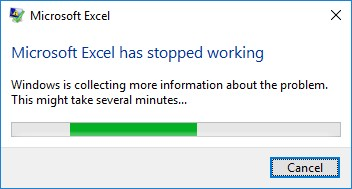

---
output:
  xaringan::moon_reader:
    css: ["rladies", "rladies-fonts"]
    nature:
      highlightStyle: github
      highlightLines: true
      countIncrementalSlides: false
    
---

class: inverse, center, top
background-image: url(https://raw.githubusercontent.com/SportStatisticsRSweet/WCSF_WorkshopInR/master/WhittenOval.jpg)
background-size: cover
# Using R to Analyse, Visualise and Report on Team-Sport Athlete Data
## Alice Sweeting, PhD
.large[Workshop - WCSF | Friday 7th June 2019]<br><br><br>

---

```{r setup, include=FALSE}
options(htmltools.dir.version = FALSE)
knitr::opts_chunk$set(fig.retina = 3, warning = FALSE, message = FALSE)
library(icon)      
library(tidyverse) 
```

class: center, left

# A little about me!
I am a Research Fellow at Victoria University within the Institute for Health and Sport. 

--

My role is embedded at the Western Bulldogs Football Club (AFL).

--

I mainly program in R and use it daily to analyse, visualise and report on athlete/ team performance data.

--

Work aside, I love being outdoors, running, and baking.

--

I also have a miniature dachshund puppy named Dudley! `#RDogLadies`

```{r out.width = '35%', echo = FALSE}

```

---

class: inverse, center, top
background-image: url(Figures/AFLW_WhittenOval.jpg)
background-size: cover
# What programs do you use to analyse athlete data?

---

class: center, left

# Advantages of using Excel

Easy to download, install, open.

--

Create a worksheet/ workbook and type away!


--

Interactive, (fairly) friendly to save, send, open and edit

--

Point and click to enter data, create figures, calculate math

--

Many tabs = data entry, analysis, visualisation, (dashboard) reporting

--

Can even run (basic to advanced) statistics!

--

Help is never far away...

```{r out.width = '45%', echo = FALSE}
knitr::include_graphics("https://media.giphy.com/media/eCz0zwSl7qxB6/giphy.gif")
```


---

class: center, top

# But before long...


---

class: center, top

# We end up here!



.footnote[
Credit: [**Dr Jacquie Tran, ESSA Forum, 2019**](https://github.com/jacquietran/2019_essa_forum)
]

---

class: center, top

# But do not despair...


---

class: center, top


# For there are better (reproducible) ways!

--

Type a line of code, run and see output 

--

Create a project, run analysis, create a dashboard and/ or report 

--

Reproducibility = Create a GitHub repo, clone, commit, push, push

--

Hard to manipulate raw data 

--

Automate reporting processes in .pdf or .html output


---

class: center, top


# For there R better (reproducible) ways!


Type a line of code, run and see output 


Create a project, run analysis, create a dashboard and/ or report 


Reproducibility = Create a GitHub repo, clone, commit, push, push


Hard to manipulate raw data 


Automate reporting processes in .pdf or .html output


---
class: center, top

# Today - a (quick) journey on using R


---

class: center, top

# What learning to use R feels like...


---

class: center, top

# What others using R looks like...


---

class: center, top

# But it isn't that daunting!


---

class: center, top

# Starting out in R

Highly recommended using [RStudio IDE](https://www.rstudio.com/products/rstudio/), as it is a friendly interface.

--

Plenty of online resources to help learn, including [R Tutorial](http://www.r-tutor.com/r-introduction/data-frame).

--

Start out with a small dataset, with analysis that you want to replicate.

--

When in doubt, visit [Stack Overflow!](https://stackoverflow.com/)

---

class: center, top

# Creating A Project

---

class: center, top

# The Tidyverse

---

class: center, top

# Cleaning Data

---

class: center, top

# Visualising Data 

---

class: center, top

# Importing Data from Smartabase

---

class: center, top

# Analysing Athlete Monitoring Data - GroinBar

---

class: center, top

# Visualising Athlete Monitoring Data - GroinBar

---

class: center, top

# Analysing Athlete Monitoring Data - GPS

---

class: center, top

# Visualising Athlete Monitoring Data - GPS

---

class: center, top

# Reporting on Athlete Monitoring Data - RMarkdown

---

class: center, top

# Creating Apps on Athlete Monitoring Data - RShiny

---

class: center, top

# Creating Projects on Athlete Monitoring Data - WorkflowR

---

class: center, top

# Creating Slides on Athlete Monitoring Data - Xaringan


---

class: center, middle

# Happy Coding in R!

`r icon::fa("link")` [SportStatisticsRSweet](http://sportstatisticsrsweet.rbind.io/)<br><br>
`r icon::fa("envelope")` [Alice.Sweeting@vu.edu.au](mailto:Alice.Sweeting@vu.edu.au)<br><br>
`r icon::fa("twitter")` [alicesweeting](https://twitter.com/alicesweeting)<br><br>


